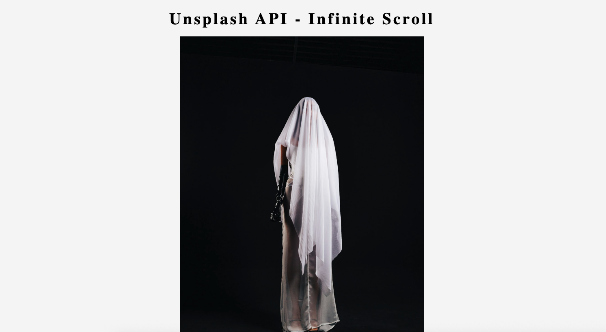

# 📸 Infinite Scroll Unsplash Gallery

## 📜 Description
This is a simple web application that demonstrates how to implement infinite scrolling using the [Unsplash API](https://unsplash.com/developers). As you scroll down the page, more images are loaded automatically, creating a smooth and dynamic image gallery experience.



## 🌐 Live Demo

👉 [Click here to try the demo](https://xandra-x.github.io/Infinity-Scroll/)


## 🚀 Features

- Fetches random photos from Unsplash using their public API
- Implements infinite scroll to automatically load more images
- Displays a loading spinner while fetching data
- Responsive layout for mobile and desktop

## 🛠️ Tech Stack

- **HTML5**
- **CSS3**
- **JavaScript (Vanilla)**
- **Unsplash API**

1. Clone this repository:
   ```bash
   https://xandra-x.github.io/Infinity-Scroll/
